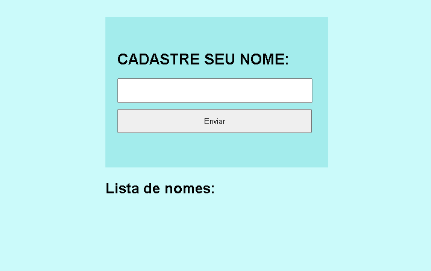
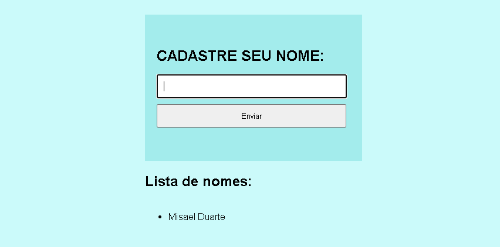

# CADASTRO DE NOMES 
Utilizando conceitos do PHP, como file_get_contents e file_put_contents, para manipulação de arquivos.
Cadastrando nome inserido no formulário, salvando no arquivo nomes.txt, e dando um print na tela.

### MOSTRANDO PARTE DO CLIENTE

### ADICIONANDO NOME NA ENTRADA

Web Developer Misael Duarte - [@misael](https://bit.ly/linkedin-misaelduarte)
Distribuído sob a licença [MIT](./LICENCE)